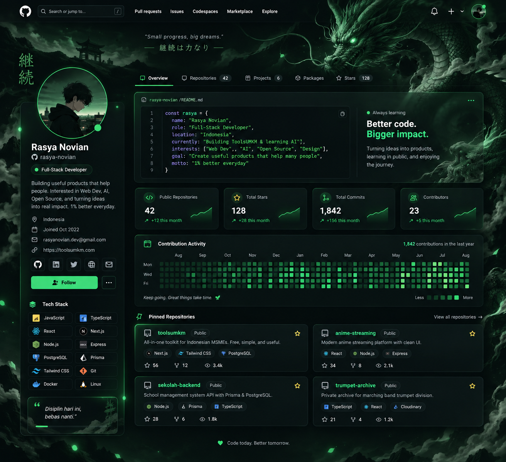

<div align="center">



<h1 align="center">🐉 Rasya Novian</h1>

<h3 align="center">Full-Stack Developer • AI Engineer • Builder</h3>

**Building useful things. Learning every day.**

<p>
  <a href="https://github.com/rsya0711">
    
  </a>
  <a href="https://toolsumkm.com">
    
  </a>
</p>

</div>

---

## `> whoami`

```ts
const rasya = {
  name: "Rasya Novian",
  role: "Full-Stack Developer & AI Engineer",
  focus: [
    "Full-Stack Development",
    "AI Engineering",
    "Open Source"
  ],
  currentlyBuilding: [
    "ToolsUMKM",
    "AI Projects",
    "Face Recognition",
    "AI Chatbot"
  ],
  stack: [
    "TypeScript",
    "React",
    "Next.js",
    "Node.js",
    "Python",
    "PostgreSQL"
  ]
};
```

---

## ⚡ Tech Stack

### Frontend
<p>
  <a href="https://skillicons.dev">
    
  </a>
</p>

### Backend
<p>
  <a href="https://skillicons.dev">
    
  </a>
</p>

### AI & Programming
<p>
  <a href="https://skillicons.dev">
    
  </a>
</p>

### Tools & DevOps
<p>
  <a href="https://skillicons.dev">
    
  </a>
</p>

---

## 🛠️ What I Do

<table>
  <tr>
    <td width="33%" valign="top">
      <h3 align="center">🌐 Web Development</h3>
      <p align="center">Building responsive, high-performance web applications and scalable backends.</p>
    </td>
    <td width="33%" valign="top">
      <h3 align="center">🤖 AI Engineering</h3>
      <p align="center">Integrating LLMs, computer vision, and building intelligent autonomous systems.</p>
    </td>
    <td width="33%" valign="top">
      <h3 align="center">🚀 Product Building</h3>
      <p align="center">Creating digital products from zero to one with focus on user experience.</p>
    </td>
  </tr>
</table>

---

## 🚀 Featured Projects

<table>
  <tr>
    <td width="50%" valign="top">

      <h3>🟢 ToolsUMKM</h3>

      <p>
        An all-in-one digital tools platform designed to help Indonesian MSMEs work smarter.
      </p>

      <strong>Stack:</strong>
      <code>Next.js</code>
      <code>TypeScript</code>
      <code>PostgreSQL</code>

      <br/><br/>

      <a href="https://toolsumkm.com">View Project →</a>

    </td>

    <td width="50%" valign="top">

      <h3>🤖 Face Recognition</h3>

      <p>
        Exploring computer vision and face recognition through practical projects and experiments.
      </p>

      <strong>Stack:</strong>
      <code>Python</code>
      <code>Computer Vision</code>
      <code>AI</code>

    </td>
  </tr>

  <tr>
    <td width="50%" valign="top">

      <h3>💬 AI Chatbot</h3>

      <p>
        Building conversational AI systems and experimenting with intelligent assistants.
      </p>

      <strong>Stack:</strong>
      <code>Python</code>
      <code>AI</code>
      <code>LLM</code>

    </td>

    <td width="50%" valign="top">

      <h3>🎺 Trumpet Archive</h3>

      <p>
        A private digital archive for marching-band trumpet activities, memories, and events.
      </p>

      <strong>Stack:</strong>
      <code>React</code>
      <code>TypeScript</code>
      <code>Cloudinary</code>

    </td>
  </tr>
</table>

---

## 📊 GitHub Statistics

<div align="center">


</div>

---

## 🌱 Currently Learning

```text
WEB DEVELOPMENT
████████████████░░░░  80%

AI ENGINEERING
███████████████░░░░░  75%

MACHINE LEARNING
██████████░░░░░░░░░░  50%

SYSTEM DESIGN
███████████░░░░░░░░░  55%

OPEN SOURCE
████████░░░░░░░░░░░░  40%
```

---

## 🔍 Currently Exploring

- Artificial Intelligence
- Machine Learning
- Deep Learning
- Generative AI
- Computer Vision
- LLM Applications
- AI Agents
- System Design
- Open Source

---

## 💻 Development Philosophy

<div align="center">

### Build
Create something useful.

### Learn
Understand how it works.

### Break
Experiment without being afraid of failure.

### Fix
Find the problem and solve it.

### Repeat
Keep getting better.

> **"1% better every day."**

</div>

---

## 🔗 Connect

<div align="center">

<a href="https://github.com/rsya0711">
  
</a>
<a href="https://toolsumkm.com">
  
</a>

</div>

---

<div align="center">

<h3 align="center"><code>Code today. Build tomorrow.</code></h3>


</div>
